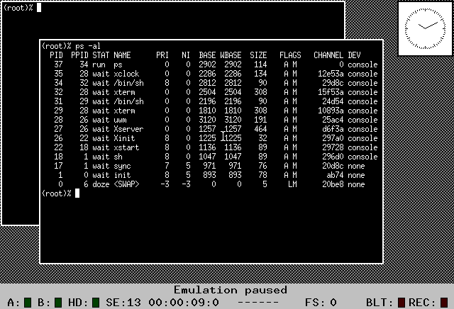

# Idris OS for the Atari ST
This repo contains the 3.5" floppy disk images of the Whitesmiths Ltd (now defunct) Idris OS
version 3.12 for the Atari ST.

The porting work was done by **David M. Stanhope** at Computer Tools (also defunct), in 1986.
He also ported MIT's X Windows (X10 R4) to the ST. The work included ST specific device drivers
as well as pseudo drivers to support networking (e.g. sockets, select).



## Distribution Manifest
The distro includes the following:
1. Boot disk (`boot.st`)
2. OS Distro disks (`dist?of2.st`)
3. Compiler disks (`compiler?of2.st`)
4. The kernel build disk (`kernbuild.st`)
5. X10R4 disks (`st_xwin10r4_?of4.st`)
6. Tar file of compressed tars of open source or PD sofware ported to Idris (`misc_*.st`)

The `docs` directory contains the scanned PDFs of the Idris manuals, STX Windows and CTI Net guides.

Idris uses the UNIX v6 file system format. To examine contents of the images, on Linux, use the
[retro-fuse](https://github.com/jaylogue/retro-fuse) `v6fs` utility to mount the
v6 fs on a diskette:
Example:
```sh
v6fs -o ro -o fsoffset=1 dist2of2.st ~/mnt/dist2
```

The filesystem on the boot disk starts at block 18 (`fsoffset=18`),
```sh
v6fs -o ro -o fsoffset=18 boot.st ~/mnt/boot
```

The `misc` floppies are tar of compressed tar files:
```sh
dd if=misc_toys.tar.st skip=1 | tar -tv
```

## Running on Hatari
Idris runs on the 520 ST and the 1040 ST, as well as the MegaST. To run X10R4 use the
MegaST emulation with 4MB of memory.

To run the system on Hatari, set `Drive A:` from _Floppy disks_ menu to the boot disk image,
then select "Reset Machine" on the main menu and press OK. After the restart, at the
`device number: ` prompt, press `0` followed by enter. Then
enter `idrisk1a` at the `[cboot]: ` prompt and then press enter. If nothing is entered at
these prompts, the input will timeout and default to booting _idrisk1a_ from the hard
drive (device number 1).

Once Idris is loaded, the shell is started and the `#` prompt will appear. Some Idris
commands are included on the boot floppy to allow bootstrapping the system onto a hard
drive.

## Hard Disk Installation
Follow the instructions in the "Idris Installation Guide for the Atari ST" in `docs`.
The last section of the guide includes instructions on how to install STX Windows
after Idris has been installed.

Hatari ACSI hard disk emulation doesn't seem to agree with Idris's ACSI driver.
A workaround patch has been created by [Christian Zietz](https://github.com/czietz)
for Hatari 2.6.1.

Idris is known to work with real Atari ACSI disks such as the SH205.
The `show0` command is used to view and designate an Idris partition (type `IDR`).
The `BuildHard` script is then used to create a filesystem on the `IDR` partition.
The installation documentation describes the number of blocks that should be reserved for
boot and swap, depending on the system memory, and the number of sectors that should be
given to `BuildHard` to pass to `mkfs` command.

Using only the boot floppy, the other floppy images can be inspected by mounting them
on Drive B. Set Drive B to point to an image (e.g. `dist1of2.st`), then mount the second
floppy by:
```sh
# mount -r /dev/fd1 /y
# ls -l /y
...
# mount -u /y
```
The `-r` flag signifies _read-only_, and the `-u` flag is equivalent to _umount_.

Once `BuildHard` is able to run successfully, it will create the hard disk partition, create
the basic file system hierarchy and copy a few commands and will prompt the user to reboot
and select to boot from the hard disk (i.e. `device number: 1`).  Once Idris can boot
from the hard drive, the `Install` scrip will guide the user through the installation
process.

# Good Luck
